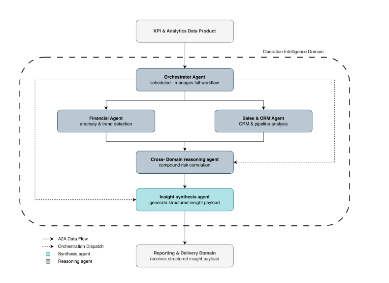

\newpage

# Section 1: Case Study

## **Business Scenario: "Pulse: Operational Intelligence Platform for SMEs"**

Small and medium-sized enterprises (SMEs) rarely have access to dedicated operational leadership. Business owners are left making critical decisions based on intuition rather than data, not because the data does not exist, but because synthesizing signals across financial systems, CRM platforms, and sales pipelines is too time-consuming to do consistently. The result is that operational problems (rising churn, deteriorating cash flow, stalling pipelines) are identified too late and acted on too slowly.

Pulse is an AI-powered Operational Intelligence Platform designed to fill this gap. Acting as a virtual Chief Operating Officer for SMEs, Pulse continuously ingests data from a company's core operational systems, computes key business metrics, detects anomalies and cross-functional patterns, and automatically generates narrative intelligence reports. Rather than functioning as a static dashboard, Pulse delivers actionable intelligence: it tells the SME owner not just what the numbers say, but what they mean and what to do about it.

The platform connects to two primary data source categories. The first is financial and accounting data, sourced from systems such as Exact Online and AFAS, covering revenue, expenses, cash flow, and outstanding invoices. The second is CRM and sales data, sourced from platforms such as HubSpot, covering pipeline value, conversion rates, churn, and new deals. Once ingested, data is normalized into a unified internal format, passed through a KPI calculation layer, and consumed by an AI agent layer that reasons across signals to produce structured, narrative intelligence reports. These reports are automatically delivered to the SME owner and relevant department heads on a scheduled cadence.

## **Stakeholders and Context Diagram**

Pulse serves four categories of external actors:

The **SME Owner / CEO** is the primary recipient of Pulse's intelligence. They receive full operational reports, act on recommendations, and represent the core user the platform is designed for.

**Department Heads** such as the head of sales or head of finance receive domain-specific report sections relevant to their area of responsibility. They interact with the platform as consumers of targeted intelligence rather than the full operational picture.

The **Pulse Platform Administrator** is an internal actor responsible for onboarding new SME clients, managing data source connectors, and maintaining platform health. This role justifies the Tenant Management domain.

**External Systems** such as Exact Online, AFAS, and HubSpot are the data providers. They do not interact with Pulse directly as users but represent the system boundary through which operational data enters the platform. We refer to @fig-context-diagram

## **High-Level Functional Requirements**

The platform must support the following high-level capabilities:

**Data ingestion and normalization.** Pulse must connect to external financial and CRM systems, retrieve operational data on a scheduled basis, and normalize it into a unified internal format for downstream processing.

**KPI computation.** The platform must compute a defined set of business metrics, including revenue growth, burn rate, cash flow position, pipeline conversion rate, and churn rate, from the normalized data and maintain a historical record of these metrics over time.

**Operational intelligence generation.** An AI agent layer must analyze computed KPIs, detect anomalies and trends, reason across signals from different operational domains, and generate natural language insights with actionable recommendations.

**Report composition and delivery.** Insights must be composed into structured, readable reports and automatically delivered to the SME owner and relevant department heads according to a configured schedule.

**Tenant and user management.** The platform must support onboarding of SME clients, management of user accounts and roles, and configuration of data source connections per tenant.

**Event-driven notifications.** The platform must send lightweight alerts for operationally significant events, such as critical anomaly detection, report delivery confirmation, or data connector failures.

## **Domain Overview**

Applying Domain-Driven Design to the functional requirements above, six domains are identified. These are explored in detail in Section 2.

Data Integration, KPI & Analytics, and Reporting & Delivery could all exist in any BI tool. What makes Pulse unique and differentiated is the reasoning layer that connects signals, understands context, and tells you what to do. We refer to @fig-domain-diagram

-   **Operational Intelligence** (core): the AI agent reasoning layer

-   **Data Integration** (supporting): external data ingestion and normalization

-   **KPI & Analytics** (core / supporting): metric computation and historical storage

-   **Reporting & Delivery** (core / supporting): report composition and scheduled delivery

-   **Tenant Management** (generic): SME onboarding, user accounts, configuration

-   **Notification** (generic): event-driven alerting

# Identification of Business/Data Domains and Services/Agents/Data Products

## **Operational Intelligence**

**Operational Intelligence** \
The Operational Intelligence domain is the core differentiating capability of Pulse. It owns the full agentic reasoning pipeline: retrieving pre-computed KPI metrics and historical trend data from the KPI & Analytics data product's analytical store as a downstream consumer, coordinating a set of specialised reasoning agents, and producing structured insight payloads containing anomaly detections, trend analyses, and actionable recommendations. The domain is triggered on a configured schedule, ensuring autonomous and predictable operation aligned with the platform's weekly reporting cadence. It explicitly does not compute KPIs, ingest or transform data, or compose and deliver reports, those responsibilities belong to the KPI & Analytics, Data Integration, and Reporting & Delivery domains respectively. By consuming only clean, pre-computed KPI summaries and trend data as input, the domain can focus entirely on reasoning logic without any data preparation concerns.

**Features**

-   Retrieve the latest KPI metrics and historical trend data from the KPI & Analytics data product on a scheduled basis and initiate the agent reasoning workflow

-   Analyse financial KPIs to detect anomalies such as abnormal burn rate increases, cash flow deterioration, or revenue decline against historical baselines

-   Analyse sales and CRM KPIs to identify pipeline stagnation, declining conversion rates, and early customer churn signals

-   Correlate signals across financial and sales domains to surface compound operational risks that neither domain-specific agent could detect in isolation

-   Generate natural language insights with prioritised, actionable recommendations for each detected signal

-   Produce a structured insight payload (tagged with domain, severity, narrative, and recommendations) for handoff to the Reporting & Delivery domain

**Agents**

Orchestrator Agent 

The Orchestrator Agent manages the full reasoning workflow. It is triggered on a configured schedule, queries the KPI & Analytics data product's analytical store to retrieve the latest KPI metrics and trend data, and dispatches the Financial Intelligence Agent and the Sales & CRM Intelligence Agent in parallel via the A2A protocol. Once their outputs are available, it sequences the Cross-Domain Reasoning Agent and finally the Insight Synthesis Agent. Design principles: 

-   coarse granularity, as it governs the complete workflow lifecycle; 

-   autonomy, as it operates independently on a schedule without requiring external triggering; 

-   observability, as it maintains a reasoning trace log across the full run to support monitoring and debugging.

Financial Intelligence Agent 

The Financial Intelligence Agent receives financial KPI metrics and historical trend data and applies LLM-driven reasoning to detect anomalies, evaluate trends, and generate financial-domain insights with accompanying recommendations. Design principles: 

-   high cohesion, as it is scoped exclusively to financial signal analysis; 

-   autonomy, as it operates with its own LLM context and reasoning prompt, independent of other agents.

Sales & CRM Intelligence Agent 

The Sales & CRM Intelligence Agent receives sales and CRM KPI metrics and reasons over pipeline health, conversion trends, deal velocity, and churn indicators to produce sales-domain insights. Design principles: 

-   high cohesion, scoped exclusively to sales and CRM signal analysis; 

-   autonomy, operating independently with its own LLM context in parallel with the Financial Intelligence Agent.

Cross-Domain Reasoning Agent 

The Cross-Domain Reasoning Agent receives the structured outputs of the Financial and Sales & CRM agents and reasons across them to identify compound operational risks, patterns that emerge only when signals from both domains are considered together, such as simultaneous revenue decline and accelerating churn pointing to a systemic business threat. Design principles: 

-   loose coupling, as it depends only on the structured output messages of the preceding agents and not on raw data or domain internals; 

-   fine granularity, as its sole responsibility is cross-signal correlation.

Insight Synthesis Agent 

The Insight Synthesis Agent collects all agent outputs and assembles them into a single normalised insight payload, where each insight is structured with a domain tag, severity level, natural language narrative, and prioritised recommendations. This payload is the domain's output contract with the Reporting & Delivery domain. Design principles: 

-   statelessness, as each synthesis run is fully self-contained and produces a reproducible output regardless of prior runs; 

-   high cohesion, focused solely on structuring and packaging the reasoning outputs.

**Design principles summary**

The Operational Intelligence domain is designed as a multi-agent system where each agent encapsulates a single, well-defined reasoning responsibility, resulting in high cohesion within agents and loose coupling between them. Agent-to-agent communication via the A2A protocol ensures that agents remain interoperable and independently evolvable without direct dependencies on each other's internals. The Orchestrator Agent applies the coarse granularity principle to govern the full workflow, while domain-specific and cross-domain agents apply fine granularity to keep reasoning concerns clearly separated. Statelessness in the Insight Synthesis Agent guarantees that downstream domains receive consistent and reproducible outputs. Taken together, these principles make the reasoning pipeline modular, observable, and resilient to changes in individual agent logic or LLM behaviour. See the figure for this domain: @fig-operational-domain

## **Data Integration**

**Bounded context description**: The data integration domain is responsible for ingesting, standardizing, and storing operational data from external systems such as financial platforms and CRM tools. It owns the full data ingestion pipeline, including API connectivity, data retrieval, validation, transformation into a unified schema, and persistence of both raw and normalized datasets. The domain ensures that heterogeneous data from multiple sources is made consistent and usable for downstream domains. 

The data integration domain does not compute business metrics, detect patterns, anomalies or generate insights. It also does not perform domain-level business logic or analytical reasoning. Its responsibility is limited to syntactic transformation and reliable data provisioning, acting as a data plumber layer between external systems and internal analytic components. 

**Features:**

-   Fetch financial transaction data from external financial systems APIs (e.g., Exact Online, AFAS)

-   Retrieve CRM data such as deals, pipeline status, and customer information from CRM platforms (e.g., HubSpot)

-   Validate incoming data against predefined schema constraints and data quality rules

-   Map source-specific data fields to a unified internal schema

-   Transform heterogeneous data into a standardized and consistent format

-   Persist both raw ingested data and normalized datasets for downstream consumption

-   Execute scheduled batch ingestion and transformation pipelines (e.g., weekly updates)

**Services / Agents / Data Products**

-   **Connector Service:** Handles connectivity with external systems and retrieves data via APIs on a scheduled or triggered basis.

    -   Design principles: Loose coupling and reusability, as connectors are isolated per source system and can be extended independently.

-   **Schema Mapping Service:** Maps source-specific data structures (e.g., financial records, CRM fields) into a unified internal schema.

    -   Design principles: High cohesion and abstraction, as it encapsulates all schema transformation logic in one place.

-   **Data Validation Service:** Validates incoming data against schema definitions and quality constraints before further processing.

    -   Design principles: Autonomy and reliability, ensuring data correctness without relying on downstream domains.

-   **Normalization Service:** Transforms validated data into a standardized format, resolving inconsistencies in structure, naming, and representation.

    -   Design principles: High cohesion and consistency, as all transformation logic is centralized and deterministic.

-   **Data Storage Service:** Persists both raw and normalized datasets in appropriate storage systems for traceability and downstream access.

    -   Design principles: Separation of concerns and scalability, allowing storage mechanisms to evolve independently.

**Design principles summary:\
**The Data Integration domain is designed around strong separation of concerns and high cohesion, where each service performs a clearly defined step in the ingestion pipeline. Loose coupling between services enables independent evolution of connectors, transformation logic, and storage mechanisms, which is essential when integrating multiple heterogeneous external systems. The domain is intentionally stateless in its processing steps, allowing scalable and repeatable batch execution. By strictly avoiding business logic and analytical reasoning, the domain maintains a clear boundary with downstream domains such as KPI & Analytics and Operational Intelligence, ensuring a modular and maintainable architecture.The Data Integration flow is intentionally shown at an abstract level. The normalization stage includes internal validation, schema mapping, and transformation steps before the resulting data is persisted in the unified data store. See @fig-data-integration

## **KPI & Analytics**

## **Reporting & Delivery**

**Bounded context description**: The Reporting & Delivery domain is responsible for composing, formatting, and distributing reports based on the outputs from the Operational Intelligence domain. It owns report templates, composition logic, stakeholder-specific report structures, delivery schedules, and recipient configurations. The domain takes analyzed insights as input and transforms them into readable and well-structured reports, such as PDF documents and summarized email notifications, ensuring that stakeholders receive clear and actionable information in a consistent format.

The Reporting & Delivery domain does not compute KPIs, perform data ingestion or transformation, or reason across signals. It does not generate or interpret business insights, as this is the responsibility of the KPI & Analytics and Operational Intelligence domains. Instead, it focuses solely on presentation, assemble, scheduling, and delivery of already generated insights, maintaining a clear boundary between intelligence generation and information communication.

### **Features:**

-   Assemble report sections into a tenant-specific report based on predefined templates

-   Structure and format insights into readable sections, tables, and summaries

-   Generate report outputs in standardized formats (e.g. PDF and email summaries)

-   Schedule report generation and delivery based on configured intervals (e.g. weekly)

-   Deliver reports to configured stakeholders (e.g. SME owner and department heads)

-   Manage report distribution settings, including recipients and delivery channels

**Services / Agents / Data Products**

-   **Composition Service: Assembles report sections by combining insights from the Operational Intelligence domain into a structured, tenant-specific report.**

    -   **Design principles: High cohesion and separation of concerns, as it focus solely on assembling a report content without handling formatting or delivery**

-   **Template Service: Applies predefined report templates to structure insights into consistent layouts and sections for each tenant.**

    -   **Design principles: Abstraction and reusability, as templates standardize report structure across tenants while allowing configuration.**

-   **Scheduling Service: Triggers report generation and delivery based on configured intervals (e.g. weekly schedules).**

    -   **Design principles: Autonomy and statelessness, enabling independent and repeatable scheduling without dependency on other services.**

-   **Delivery Service: Distributes generated reports to stakeholders via configured channels (e.g. email with PDF attachments and summary messages).**

    -   **Design principles: Loose coupling and scalability, as delivery mechanisms are decoupled from report generation and can evolve independently**

\
**Design principles summary\
**The Reporting & Delivery domain is designed with strong separation of concerns, where composition, templating, scheduling, and delivery are handled by distinct services. High cohesion ensures that each service focuses on a single responsibility, while loose coupling allows independent evolution of report generation and delivery mechanisms. The domain operates in a stateless and configurable manner, supporting scalable and repeatable report generation. By avoiding analytical logic and relying on upstream domains for insights, it maintains a clear boundary between intelligence generation and information presentation. And i refer to the diagram which has been made for this domain @fig-diagram-report

## **Tenant Management**

## **Notification**

# Architectural Design

# Member Contribution and Reflection

## Member Contribution

## Reflection

# Technology Statement

Use the required template exactly as provided in the assignment brief .

Example format:

During the preparation of this work, we used \[NAME TOOL / SERVICE / VERSION\] in order to \[REASON\]. The following parts of the assignment were affected/generated by AI tool usage: \[SECTIONS\]. After using this tool/service, \[NAME STUDENT(S)\] evaluated the validity of the tool’s outputs and edited the content as needed. As a consequence, \[NAME STUDENT(S)\] take full responsibility for the content of this work.

# References

# Appendix

{#fig-context-diagram}

{#fig-domain-diagram}

{#fig-operational-domain}

{#fig-data-integration}

{#fig-diagram-report}
