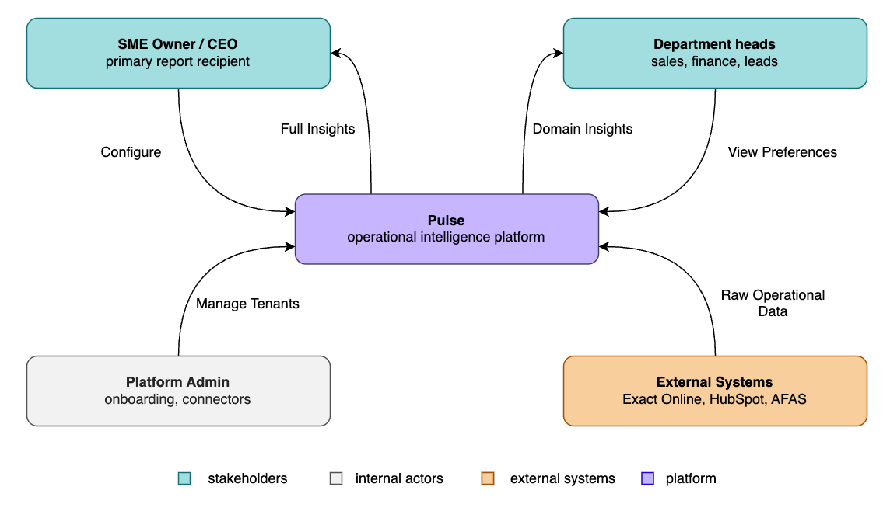
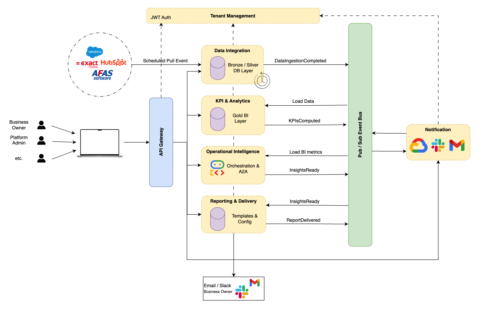
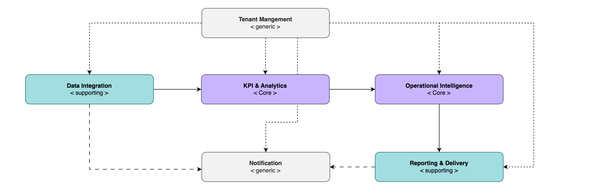
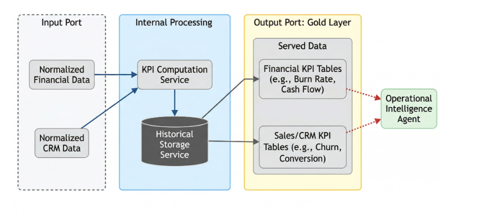
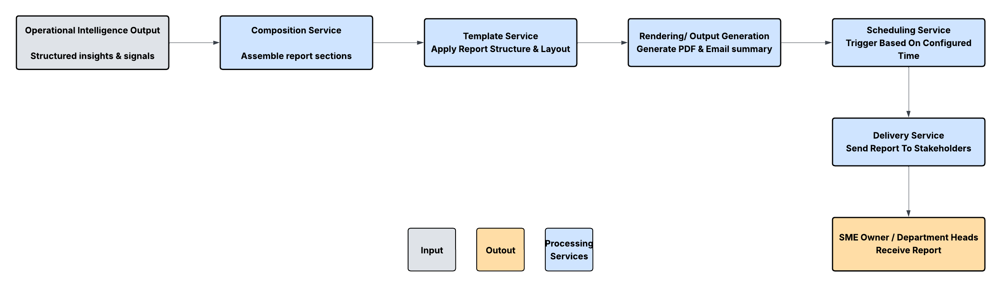

\newpage

# Section 1: Case Study

## **Business Scenario: "Pulse: Operational Intelligence Platform for SMEs"**

Small and medium-sized enterprises (SMEs) rarely have access to dedicated operational leadership. Business owners are left making critical decisions based on intuition rather than data, not because the data does not exist, but because synthesizing signals across financial systems, CRM platforms, and sales pipelines is too time-consuming to do consistently. The result is that operational problems (rising churn, deteriorating cash flow, stalling pipelines) are identified too late and acted on too slowly.

Pulse is an AI-powered Operational Intelligence Platform designed to fill this gap. Acting as a virtual Chief Operating Officer for SMEs, Pulse continuously ingests data from a company's core operational systems, computes key business metrics, detects anomalies and cross-functional patterns, and automatically generates narrative intelligence reports. Rather than functioning as a static dashboard, Pulse delivers actionable intelligence: it tells the SME owner not just what the numbers say, but what they mean and what to do about it.

The platform connects to two primary data source categories. The first is financial and accounting data, sourced from systems such as Exact Online and AFAS, covering revenue, expenses, cash flow, and outstanding invoices. The second is CRM and sales data, sourced from platforms such as HubSpot, covering pipeline value, conversion rates, churn, and new deals. Once ingested, data is normalized into a unified internal format, passed through a KPI calculation layer, and consumed by an AI agent layer that reasons across signals to produce structured, narrative intelligence reports. These reports are automatically delivered to the SME owner and relevant department heads on a scheduled cadence.

## **Stakeholders and Context Diagram**

Pulse serves four categories of external actors:

The **SME Owner / CEO** is the primary recipient of Pulse's intelligence. They receive full operational reports, act on recommendations, and represent the core user the platform is designed for.

**Department Heads** such as the head of sales or head of finance receive domain-specific report sections relevant to their area of responsibility. They interact with the platform as consumers of targeted intelligence rather than the full operational picture.

The **Pulse Platform Administrator** is an internal actor responsible for onboarding new SME clients, managing data source connectors, and maintaining platform health. This role justifies the Tenant Management domain.

**External Systems** such as Exact Online, AFAS, and HubSpot are the data providers. They do not interact with Pulse directly as users but represent the system boundary through which operational data enters the platform.

{#diagram-stakeholders}

## **High-Level Functional Requirements**

The platform must support the following high-level capabilities:

**Data ingestion and normalization.** Pulse must connect to external financial and CRM systems, retrieve operational data on a scheduled basis, and normalize it into a unified internal format for downstream processing.

**KPI computation.** The platform must compute a defined set of business metrics, including revenue growth, burn rate, cash flow position, pipeline conversion rate, and churn rate, from the normalized data and maintain a historical record of these metrics over time.

**Operational intelligence generation.** An AI agent layer must analyze computed KPIs, detect anomalies and trends, reason across signals from different operational domains, and generate natural language insights with actionable recommendations.

**Report composition and delivery.** Insights must be composed into structured, readable reports and automatically delivered to the SME owner and relevant department heads according to a configured schedule.

**Tenant and user management.** The platform must support onboarding of SME clients, management of user accounts and roles, and configuration of data source connections per tenant.

**Event-driven notifications.** The platform must send lightweight alerts for operationally significant events, such as critical anomaly detection, report delivery confirmation, or data connector failures.

## **Domain Overview**

Applying Domain-Driven Design to the functional requirements above, six domains are identified. These are explored in detail in Section 2.

Data Integration, KPI & Analytics, and Reporting & Delivery could all exist in any BI tool. What makes Pulse unique and differentiated is the reasoning layer that connects signals, understands context, and tells you what to do. We refer to @fig-domain-diagram

-   **Operational Intelligence** (core): the AI agent reasoning layer

-   **Data Integration** (supporting): external data ingestion and normalization

-   **KPI & Analytics** (core): metric computation and historical storage

-   **Reporting & Delivery** (core / supporting): report composition and scheduled delivery

-   **Tenant Management** (generic): SME onboarding, user accounts, configuration

-   **Notification** (generic): event-driven alerting

# Identification of Business/Data Domains and Services/Agents/Data Products

## **Operational Intelligence**

**Operational Intelligence**\
The Operational Intelligence domain is the core differentiating capability of Pulse. It owns the full agentic reasoning pipeline: retrieving pre-computed KPI metrics and historical trend data from the KPI & Analytics data product's analytical store as a downstream consumer, coordinating a set of specialised reasoning agents, and producing structured insight payloads containing anomaly detections, trend analyses, and actionable recommendations. The domain is triggered on a configured schedule, ensuring autonomous and predictable operation aligned with the platform's weekly reporting cadence. It explicitly does not compute KPIs, ingest or transform data, or compose and deliver reports, those responsibilities belong to the KPI & Analytics, Data Integration, and Reporting & Delivery domains respectively. By consuming only clean, pre-computed KPI summaries and trend data as input, the domain can focus entirely on reasoning logic without any data preparation concerns.

**Features**

-   Retrieve the latest KPI metrics and historical trend data from the KPI & Analytics data product on a scheduled basis and initiate the agent reasoning workflow

-   Analyse financial KPIs to detect anomalies such as abnormal burn rate increases, cash flow deterioration, or revenue decline against historical baselines

-   Analyse sales and CRM KPIs to identify pipeline stagnation, declining conversion rates, and early customer churn signals

-   Correlate signals across financial and sales domains to surface compound operational risks that neither domain-specific agent could detect in isolation

-   Generate natural language insights with prioritised, actionable recommendations for each detected signal

-   Produce a structured insight payload (tagged with domain, severity, narrative, and recommendations) for handoff to the Reporting & Delivery domain

**Agents**

**Orchestrator Agent** 

The Orchestrator Agent manages the full reasoning workflow. It is triggered on a configured schedule, queries the KPI & Analytics data product's analytical store to retrieve the latest KPI metrics and trend data, and dispatches the Financial Intelligence Agent and the Sales & CRM Intelligence Agent in parallel via the A2A protocol. Once their outputs are available, it sequences the Cross-Domain Reasoning Agent and finally the Insight Synthesis Agent. Design principles: 

-   coarse granularity, as it governs the complete workflow lifecycle; 

-   autonomy, as it operates independently on a schedule without requiring external triggering; 

-   observability, as it maintains a reasoning trace log across the full run to support monitoring and debugging.

**Financial Intelligence Agent** 

The Financial Intelligence Agent receives financial KPI metrics and historical trend data and applies LLM-driven reasoning to detect anomalies, evaluate trends, and generate financial-domain insights with accompanying recommendations. Design principles: 

-   high cohesion, as it is scoped exclusively to financial signal analysis; 

-   autonomy, as it operates with its own LLM context and reasoning prompt, independent of other agents.

**Sales & CRM Intelligence Agent** 

The Sales & CRM Intelligence Agent receives sales and CRM KPI metrics and reasons over pipeline health, conversion trends, deal velocity, and churn indicators to produce sales-domain insights. Design principles: 

-   high cohesion, scoped exclusively to sales and CRM signal analysis; 

-   autonomy, operating independently with its own LLM context in parallel with the Financial Intelligence Agent.

**Cross-Domain Reasoning Agent** 

The Cross-Domain Reasoning Agent receives the structured outputs of the Financial and Sales & CRM agents and reasons across them to identify compound operational risks, patterns that emerge only when signals from both domains are considered together, such as simultaneous revenue decline and accelerating churn pointing to a systemic business threat. Design principles: 

-   loose coupling, as it depends only on the structured output messages of the preceding agents and not on raw data or domain internals; 

-   fine granularity, as its sole responsibility is cross-signal correlation.

**Insight Synthesis Agent** 

The Insight Synthesis Agent collects all agent outputs and assembles them into a single normalised insight payload, where each insight is structured with a domain tag, severity level, natural language narrative, and prioritised recommendations. This payload is the domain's output contract with the Reporting & Delivery domain. Design principles: 

-   statelessness, as each synthesis run is fully self-contained and produces a reproducible output regardless of prior runs; 

-   high cohesion, focused solely on structuring and packaging the reasoning outputs.

**Design principles summary**

The Operational Intelligence domain is designed as a multi-agent system where each agent encapsulates a single, well-defined reasoning responsibility, resulting in high cohesion within agents and loose coupling between them. Agent-to-agent communication via the A2A protocol ensures that agents remain interoperable and independently evolvable without direct dependencies on each other's internals. The Orchestrator Agent applies the coarse granularity principle to govern the full workflow, while domain-specific and cross-domain agents apply fine granularity to keep reasoning concerns clearly separated. Statelessness in the Insight Synthesis Agent guarantees that downstream domains receive consistent and reproducible outputs. Taken together, these principles make the reasoning pipeline modular, observable, and resilient to changes in individual agent logic or LLM behaviour.

{#operational-intelligence-domain}

## **Data Integration**

The data integration domain is classified as a supporting domain because it enables downstream analytical and reasoning capabilities by providing clean, standardized data, but does not directly deliver business value to end users.The Data Integration domain is responsible for ingesting, standardizing, and storing operational data from external systems such as financial platforms and CRM tools. It owns the full data ingestion pipeline, including API connectivity, data retrieval, validation, transformation into a unified schema, and persistence of both raw and normalized datasets. The domain ensures that heterogeneous data from multiple sources is made consistent and usable for downstream domains.

The data integration domain does not compute business metrics, detect patterns or anomalies, or generate insights. It also does not perform domain-level business logic or analytical reasoning. Its responsibility is limited to syntactic transformation and reliable data provisioning, acting as a data plumbing layer between external systems and internal analytical components.

**Features:**

-   Fetch financial transaction data from external financial systems APIs (e.g., Exact Online, AFAS)

-   Retrieve CRM data such as deals, pipeline status, and customer information from CRM platforms (e.g., HubSpot)

-   Validate incoming data against predefined schema constraints and data quality rules

-   Map source-specific data fields to a unified internal schema

-   Transform heterogeneous data into a standardized and consistent format

-   Persist both raw ingested data and normalized datasets for downstream consumption

-   Execute scheduled batch ingestion and transformation pipelines (e.g., weekly updates)

**Services / Agents / Data Products**

-   **Connector Service:** The Connector Service is a microservice responsible for retrieving data from external systems via APIs on a scheduled or triggered basis. It is classified as a microservice because it encapsulates a single integration capability and operates independently per source system.

    -   **Design principles**: Loose coupling and reusability, as connectors are isolated per source system and can be extended independently without affecting other parts of the ingestion pipeline.

    -   **An alternative:** would have been to implement a single unified ingestion service for all external sources, but this was rejected because it would reduce modularity, increase coupling between integrations, and make it harder to extend or maintain individual connectors.

-   **Schema Mapping Service:** The Schema Mapping Service is a data transformation service that maps source-specific data structures, such as financial records and CRM fields, into a unified internal schema. It is classified as a transformation service because it performs a dedicated and deterministic schema-conversion step within the ingestion pipeline.

    -   **Design principles:** High cohesion and abstraction, as it encapsulates all schema transformation logic in one place.

    -   **Alternative**: An alternative would have been to embed schema mapping logic directly inside each connector, but this was rejected because it would duplicate transformation logic across integrations and reduce maintainability. 

-   **Data Validation Service:** The Data Validation Service is a validation component that checks incoming data against schema definitions and quality constraints before further processing. It is classified as a validation service because its sole responsibility is to ensure data correctness at the ingestion stage.

    -   **Design principles:** Autonomy and reliability, ensuring data correctness without relying on downstream domains.

-   **Normalization Service:** The Normalization Service is a transformation component that converts validated data into a standardized internal format, resolving inconsistencies in structure, naming, and representation. It is classified as a transformation service because it performs deterministic normalization of source data for downstream use**.**

    -   **Design principles:** High cohesion and consistency, as all transformation logic is centralized and deterministic.

-   **Data Storage Service:** The Data Storage Service is a storage component responsible for persisting both raw and normalized datasets for traceability and downstream access. It is classified as a storage service because it owns the persistence layer of the Data Integration domain.

    -   **Design principles:** Separation of concerns and scalability, allowing storage mechanisms to evolve independently**.**

    -   **Alternative:** An alternative would have been to store only normalized data and discard raw ingested data, but this was rejected because retaining raw data improves traceability, debugging, and reprocessing capabilities. 

**Design principles summary:**The Data Integration domain is designed around strong separation of concerns and high cohesion, where each service performs a clearly defined step in the ingestion pipeline. Loose coupling between services enables independent evolution of connectors, transformation logic, and storage mechanisms, which is essential when integrating multiple heterogeneous external systems.The processing steps within the domain are intentionally stateless, allowing scalable and repeatable batch execution, while state persistence is explicitly handled by the Data Storage Service. By strictly avoiding business logic and analytical reasoning, the domain maintains a clear boundary with downstream domains such as KPI & Analytics and Operational Intelligence.This design ensures that the domain remains modular, maintainable, and easily extensible when new data sources or schema variations are introduced, without impacting downstream analytical components. The visualization of this domain you can see here: @fig-data-integration

## **KPI & Analytics**

The KPI & Analytics domain is designed as a data product that serves as the analytical engine of the platform. It is responsible for transforming normalized operational data into business metrics and maintaining the historical state for trend analysis. The domain owns its internal storage, computation logic, and its output interfaces. The domain responsibility is merely focused on the computation and storage of metrics. It does not interpret data, detect anomalies, or generate natural language insights; those responsibilities are done by the Operational Intelligence domain.

**Features**

-   Compute financial metrics, e.g., monthly burn rate, revenue growth, cash flow from normalized expense and income data.

-   Compute sales and CRM metrics such as conversion rates, deal velocity, and customer churn rates.

-   Store and version the calculated metrics over time to maintain historical records for trend analysis.

-   Structure the pre-computed metrics into a “Gold Layer” organized by domain (Financial vs. Sales/CRM) for retrieval.

-   Expose data serving interface for downstream consumers, specifically the Operational Intelligence Orchestrator Agent.

**Services / Data Products**

**KPI Computation Service:** Calculates the business metrics from normalized data inputs.

-   Design Principles: High cohesion and statelessness, the service is focused solely on the metric calculation, and each run is deterministic, relying only on the input data for that period.

**Historical Storage Service:** Manages the persistence and versioning of metrics to ensure a reliable data source for historical trends.

-   Design Principles: Autonomy and observability, the service owns its own database, preventing other domains from accessing it. Additionally, it implements observability by tracking data lineage to ensure traceable metrics.

**Data Serving Layer:** Exposes the pre-computed tables to downstream domains through a standardized interface.

-   Design Principles: Discoverability and loose coupling, the interface is clearly defined so that the Operational Intelligence Orchestrator can query relevant metrics. This also allows the internal storage schema to be changed without breaking downstream agents.

**Design Principles Summary**

The KPI & Analytics domain functions as a data product by owning the lifecycle of a business metric from calculation to storage and serving. High cohesion is maintained by separating calculation from storage management, and autonomy is ensured through the domain’s ownership of its data state. By exposing a clearly defined serving interface, the domain maintains loose coupling with the Operational Intelligence layer so that metric calculations and internal data structures can evolve independently. For the architecture design for this domain see @fig-kpi-domain

## **Reporting & Delivery**

The Reporting & Delivery domain is classified as a supporting domain because it enables the delivery of insights generated by the core Operational Intelligence domain, but does not itself perform analytical reasoning or generate business value independently.

The Reporting & Delivery domain is responsible for composing, formatting, and distributing reports based on the outputs from the Operational Intelligence domain. It owns report templates, composition logic, stakeholder-specific report structures, delivery schedules, and recipient configurations. The domain takes analyzed insights as input and transforms them into readable and well-structured reports, such as PDF documents and summarized email notifications, ensuring that stakeholders receive clear and actionable information in a consistent format.

The Reporting & Delivery domain does not compute KPIs, perform data ingestion or transformation, or reason across signals. It does not generate or interpret business insights, as this is the responsibility of the KPI & Analytics and Operational Intelligence domains. Instead, it focuses solely on presentation, assembly, scheduling, and delivery of already generated insights, maintaining a clear boundary between intelligence generation and information communication.

**Features:**

-   Assemble report sections into a tenant-specific report based on predefined templates

-   Structure and format insights into readable sections, tables, and summaries

-   Generate report outputs in standardized formats (e.g. PDF and email summaries)

-   Schedule report generation and delivery based on configured intervals (e.g. weekly)

-   Deliver reports to configured stakeholders (e.g. SME owner and department heads)

-   Manage report distribution settings, including recipients and delivery channels

**Services / Agents / Data Products**

-   **Composition Service:** The Composition Service is a microservice responsible for assembling report sections by combining structured insights from the Operational Intelligence domain into a tenant-specific report. It is classified as a microservice because it encapsulates a single business capability and operates independently within the reporting pipeline.

    -   **Design principles:** High cohesion and separation of concerns, as it focus solely on assembling a report content without handling formatting or delivery

    -   **An alternative** would have been to let the Operational Intelligence domain generate fully composed reports, but this was rejected because it would mix reasoning and presentation concerns, violating separation of concerns.

-   **Template Service:** The Template Service is a template management component that applies predefined templates to structure insights into consistent layouts and sections for each tenant. It is classified as a template service because it separates presentation structure from report content. 

    -   **Design principles:** Abstraction and reusability, as templates standardize report structure across tenants while allowing configuration.

    -   **An alternative** would have been to hardcode report structures within the Composition Service, but this was rejected because it would reduce flexibility and limit reuse across tenants.

-   **Scheduling Service:** The Scheduling Service is a scheduling component responsible for triggering report generation and delivery based on configured intervals. It is classified as a scheduling service because it manages time-based orchestration independently of report generation logic. 

    -   **Design principles:** Autonomy and statelessness, enabling independent and repeatable scheduling without dependency on other services

    -   **An alternative** would have been to trigger reporting exclusively through upstream events, but this was rejected because reporting requires predictable, time-based delivery independent of pipeline execution timing. .

-   **Delivery Service:** The Delivery Service is a microservice responsible for distributing generated reports to stakeholders via configured channels such as email and PDF attachments. It is classified as a microservice because it encapsulates delivery logic and can scale independently of report generation. 

    -   **Design principles:** Loose coupling and scalability, as delivery mechanisms are decoupled from report generation and can evolve independently

    -   **An alternative** would have been to embed delivery logic within the Composition Service, but this was rejected because it would tightly couple report generation and distribution, reducing flexibility and scalability. 

**Design principles summary\
**The Reporting & Delivery domain is designed with strong separation of concerns, where composition, templating, scheduling, and delivery are handled by distinct services. High cohesion ensures that each service focuses on a single responsibility, while loose coupling allows independent evolution of report generation and delivery mechanisms.The domain operates in a stateless and configurable manner at the service level, supporting scalable and repeatable report generation, while configuration and delivery state are managed explicitly where required. By avoiding analytical logic and relying on upstream domains for insights, it maintains a clear boundary between intelligence generation and information presentation.This design ensures that reporting functionality remains modular, flexible, and easily extensible, allowing new report formats, templates, and delivery channels to be introduced without impacting upstream domains. And i refer to the diagram which has been made for this domain @fig-diagram-report

## **Tenant Management**

Bounded context description: The Tenant Management domain is responsible for onboarding SME clients, managing tenant-specific configuration, and controlling user access within the Pulse platform. It owns tenant registration, user accounts, role assignments, connector configuration metadata, and the isolation of tenant-level settings required by other domains. This domain ensures that each SME operates within its own bounded operational space, with the correct users, permissions, and data source configuration in place before any ingestion, analytics, or reporting can occur. The domain does not ingest external business data, compute KPIs, generate operational insights, or deliver reports. Its responsibility is purely administrative and configurational, which makes its boundary clear and defensible within the overall architecture.

**Features:**

-   Register a new SME tenant and initialize its platform workspace

-   Create, update, and deactivate tenant-specific user accounts

-   Assign and manage user roles such as SME Owner, Department Head, and Platform Administrator

-   Store and manage connector configuration metadata per tenant for systems such as Exact, AFAS, and HubSpot

-   Enforce tenant isolation for users, settings, and downstream service access

-   Maintain tenant lifecycle state, for example active, suspended, or offboarded

**Services / Data Products**

**Tenant Onboarding Service**: Creates a new tenant, initializes the tenant workspace, and registers the baseline configuration required for platform usage.

-   Design principles: high cohesion, because it focuses solely on tenant creation and initialization; separation of concerns, because onboarding logic is isolated from authentication, analytics, and connector execution.

**User and Role Management Service**: Manages user accounts within each tenant and assigns the correct access roles based on stakeholder responsibilities.

-   Design principles: high cohesion, because all identity and authorization administration is centralized here; loose coupling, because downstream domains only consume role and tenant context rather than implementing their own user logic.

**Tenant Configuration Service**: Stores and manages tenant-level settings such as connector metadata, report preferences, and domain-specific configuration references.

-   Design principles: abstraction, because configuration is exposed through a clean internal interface rather than embedded across domains; reusability, because all other domains can rely on one consistent source of tenant configuration.

**Access Control Service**: Enforces tenant boundaries and validates whether a given user or process may access a tenant’s resources or configuration.

-   Design principles: reliability, because correct access enforcement is essential for multi-tenant integrity; statelessness, because authorization checks should be repeatable and independent per request.

**Design principles summary**

The Tenant Management domain is intentionally designed as a thin generic domain that centralizes administrative responsibilities without absorbing business logic from other domains. High cohesion is achieved by grouping onboarding, user administration, configuration, and access control into clearly scoped services, while loose coupling ensures that downstream domains depend only on tenant context and permissions, not on internal management workflows. By keeping tenant state and configuration explicit, the architecture supports clean multi-tenant isolation and simpler operational governance. This makes the platform easier to scale across multiple SME clients while preserving a clear separation between administration and operational intelligence.

## **Notification**

**Bounded context description**

The Notification domain is responsible for dispatching event-driven alerts to stakeholders and platform administrators through email, SMS, and Slack. It owns the routing logic that determines which channel to use for a given event, the formatting of alert messages per channel, and the reliable delivery of those messages. The domain is triggered by events emitted from other domains, primarily report delivery confirmations from Reporting & Delivery and platform-level incidents such as connector failures from Data Integration.It does not generate insights, compose reports, or determine the business significance of events; it formats, routes, and delivers notification requests. Note: full report distribution (e.g., PDF attachments) is owned by the Reporting & Delivery domain. This domain handles lightweight alerting only, such as confirmations, warnings, and failure notices.

**Features**

-   Receive notification trigger events from upstream domains via an internal event bus

-   Route each notification to the appropriate channel (email, SMS, Slack) based on event type and recipient configuration

-   Format alert messages per channel, respecting channel-specific constraints (character limits, block formatting)

-   Dispatch notifications through external provider APIs like Slack Webhooks

-   Track delivery status and emit confirmation or failure events for observability

**Services**

**Notification Router Service** Receives incoming notification events and determines the target channel(s) based on event type and recipient preferences.

-   Design principles: loose coupling, as it depends only on a standardised event schema with no direct dependency on emitting domains; high cohesion, as it handles routing logic exclusively.

**Message Formatting Service** Transforms routed notification content into the appropriate channel format, which is short text for SMS, block message for Slack, templated HTML for email alerts.

-   Design principles: reusability, as formatting templates are shared across event types which helps with high cohesion, as all channel-specific formatting is centralised here.

**Dispatch Service** Sends formatted messages to external channel providers and records delivery outcomes.

-   Design principles: autonomy, as it manages its own retry logic independently of upstream services; observability, as it logs delivery status and emits confirmation or failure events for platform monitoring.

**Design principles summary**

The Notification domain is kept thin and generic. Loose coupling to upstream domains is achieved through a standardised event schema on the event bus, allowing any domain to trigger notifications without the Notification domain needing knowledge of the emitting context. Routing, formatting, and dispatch are separated into three cohesive services, meaning a new channel can be added by extending only the Formatting and Dispatch services. Statelessness in the router and formatter, combined with autonomous retry handling in the Dispatch Service, keeps the pipeline resilient and independently scalable

# Architectural Design

## Architectural Overview

The Pulse platform is designed as an event-driven, multi-domain architecture in which six bounded contexts operate independently, each owning its own database and communicating through a central event bus. External actors interact with the platform exclusively through an API Gateway, which serves as the single entry point for all inbound requests. No domain exposes itself directly to external traffic, and no domain accesses another domain's database directly.

The operational pipeline is initiated by a Scheduler, which triggers the Data Integration domain on a configured per-tenant cadence. From that point, the pipeline progresses entirely through asynchronous domain events. When Data Integration completes its ingestion and normalisation cycle, it publishes a DataIngestionCompleted event to the event bus. The KPI & Analytics domain consumes this event, computes the relevant business metrics, and publishes a KPIsComputed event. The Operational Intelligence domain then consumes that event, executes its internal multi-agent reasoning pipeline via the A2A protocol, and publishes an InsightPayloadReady event upon completion. Finally, the Reporting & Delivery domain consumes that event, composes and dispatches the report, and publishes a ReportDelivered event. The Notification domain sits across this entire pipeline, subscribing to both operational events such as report delivery confirmations and failure events such as connector failures emitted by Data Integration.

Tenant Management sits orthogonally to this pipeline. It does not participate in the event flow but is instead queried synchronously via REST by other domains when they require tenant configuration, user roles, or access validation. The event-driven approach was chosen over direct synchronous REST calls between domains for three reasons:

-   First, it ensures loose coupling: no domain needs to know the address or availability of a downstream domain in order to complete its work.

-   Second, it provides natural resilience, since the event bus persists events until a subscriber is available, meaning a temporarily unavailable domain will not cause the pipeline to fail.

-   Third, it enables non-blocking execution, allowing the pipeline to progress asynchronously without any domain holding a connection open while waiting for a downstream response.

The alternative of chaining REST calls between domains was rejected precisely because it would have introduced tight temporal coupling, where the failure or slowness of any single domain would propagate upstream and stall the entire pipeline. The Architecture design can be seen here below:

{#fig-design-architecture-section3}

## Component Descriptions

### Event Bus

The event bus is the central asynchronous messaging infrastructure that implements the Pub/Sub pattern described in Section 3.1. Domains publish events (e.g., DataIngestionCompleted, KPIComputationCompleted, InsightGenerationCompleted, ReportDelivered) when they finish their work, and subscribing domains are triggered independently. The bus persists events until subscribers are available, ensuring no signal is lost if a downstream domain is temporarily unavailable. It also carries failure events (e.g., DataIngestionFailed) that the Notification domain subscribes to for platform-wide alerting.

### API Gateway

The API Gateway serves as the single entry point for all external and cross-domain synchronous communication. It routes incoming REST requests to the correct domain, handles authentication, enforces tenant-level access control in coordination with the Tenant Management domain, and applies rate limiting. By centralizing these concerns, individual domains do not implement their own authentication or routing logic, keeping them focused on business functionality.

### Scheduler

The Scheduler triggers time-based workflows across the platform, most notably the weekly reporting cadence. It initiates the pipeline by invoking Data Integration on a configured schedule, which then cascades through the event bus to downstream domains. The Scheduler is also used by the Reporting & Delivery domain to time report generation and dispatch. Scheduling configuration is stored per tenant, allowing each SME to have its own reporting cadence.

### Per-Domain Databases

Each domain owns its own database to enforce data isolation and maintain domain autonomy. Data Integration owns the unified data store for normalized raw data, KPI & Analytics owns the Gold Layer storage for computed metrics and historical records, Tenant Management owns the tenant and user configuration store, and Reporting & Delivery owns the report template and delivery configuration store. Domains never access each other's databases directly; all cross-domain data retrieval is mediated through REST APIs or event payloads. This prevents tight coupling at the data layer and allows each domain to evolve its storage schema independently.

### Agent Communication Layer (A2A)

The Agent-to-Agent (A2A) protocol is the communication layer used exclusively within the Operational Intelligence domain to coordinate its multi-agent reasoning workflow. The Orchestrator Agent uses A2A to dispatch the Financial Intelligence Agent and Sales & CRM Intelligence Agent in parallel, then sequences the Cross-Domain Reasoning Agent and Insight Synthesis Agent. A2A carries structured agent outputs between reasoning stages, allowing each agent to operate with its own LLM context while remaining interoperable. This layer is internal to Operational Intelligence and is not used for communication between domains, domain-level communication uses the event bus and REST.

## Design Patterns

### Security (API Gateway + JWT Access)

The API Gateway pattern centralises all external access to the platform through a single entry point that handles authentication, request routing, and tenant-level access control. In the Pulse architecture, every request from external actors such as the SME Owner, Department Heads, and Platform Administrator passes through the API Gateway before reaching any internal domain. The gateway validates a tenant-scoped JSON Web Token (JWT) on each request, where the token carries tenant ID and role claims. This allows downstream domains to enforce tenant isolation and role-based access directly from the token without calling back to the Tenant Management domain on every request, reducing latency and keeping business services focused on their own responsibilities. The gateway also applies rate limiting to protect internal services from excessive external traffic. This directly supports the multi-tenant architecture, as every request is scoped to a specific tenant before it reaches any domain.

The alternative considered was decentralised authentication, where each domain would validate credentials and enforce access control independently. This was rejected because it would duplicate security logic across every domain, increasing the risk of inconsistent enforcement and making it harder to update authentication policies platform-wide. The API Gateway was chosen because it centralises security concerns in a single component, ensures consistent tenant isolation across all domains, and allows security policies to be modified in one place without touching individual domain services.

### Resilience (Circuit Breaker pattern)

The Circuit Breaker pattern is a resilience mechanism that wraps outbound calls in a stateful proxy which monitors failure rates across three states: closed (requests pass through normally), open (requests fail immediately without reaching the target), and half-open (limited probe requests test whether the target has recovered). In the Pulse architecture, it is applied to the Connector Service within the Data Integration domain, which calls external APIs such as Exact Online, AFAS, and HubSpot to ingest operational data. These are third-party dependencies outside the platform's control that may experience downtime or degraded performance. When a source system becomes unavailable, the circuit opens and the Connector Service fails fast rather than repeatedly hitting the unresponsive endpoint, preventing the ingestion pipeline from stalling. While the circuit is open, the service emits a ConnectorFailure event to the event bus, which the Notification domain consumes to alert the Platform Administrator immediately.

The alternative considered was a Rate Limiter pattern. While rate limiting is effective for protecting a service from being overwhelmed by incoming traffic, it addresses a different problem, which is throttling inbound load rather than handling outbound dependency failure. The Circuit Breaker was chosen because it directly addresses the risk of cascading failures when calling unreliable third-party systems, provides an explicit recovery mechanism through the half-open state, and integrates naturally with the platform's event bus for real-time failure alerting.

### Observability (Distributed Tracing with Correlation IDs)

Distributed Tracing with Correlation IDs is an observability mechanism that propagates a unique identifier through every step of a workflow, making it possible to reconstruct the full execution path across service boundaries. In the Pulse architecture, a single reporting cycle spans four domain boundaries: Data Integration, KPI & Analytics, Operational Intelligence, and Reporting & Delivery, each communicating through the event bus. A trace_id is generated at the start of each cycle when the Scheduler triggers Data Integration and is attached to every subsequent event such as DataIngestionCompleted, KPIComputationCompleted, InsightGenerationCompleted, and ReportDelivered. This allows platform operators to trace a complete reporting run from ingestion to delivery, identify exactly where a failure occurred, and correlate it with the reasoning trace log maintained by the Orchestrator Agent within the Operational Intelligence domain.

The alternative considered was centralised logging without correlation, where each domain logs independently and operators query logs by timestamp to reconstruct a run. This was rejected because timestamp-based correlation is unreliable when multiple tenant pipelines run concurrently, making it difficult to distinguish which log entries belong to which reporting cycle. Correlation IDs were chosen because they provide a deterministic link across all domain boundaries, enabling precise end-to-end debugging and directly supporting the failsafe alerting described in the Notification domain, where a failed run must be traceable back to its root cause.

# Member Contribution and Reflection

## Member Contribution

Thom Verzantvoort contributed to Section 1 (case study framing, stakeholder identification, and domain overview) and led Section 2 for the Operational Intelligence domain, including the multi-agent design and A2A protocol rationale. Thom also led Section 3.1, developing the overall architectural overview and event-driven system design.

Rick de Rijk contributed to Section 1 (functional requirements and context diagram) and led Section 2 for the Data Integration and Reporting & Delivery domains, covering the ingestion pipeline, composition, templating, scheduling, and delivery services. Rick also led Section 3.2, describing the architectural components including the event bus, API gateway, scheduler, per-domain databases, and the A2A communication layer.

Tycho van Rooij led Section 2 for the Notification domain, designing the event-driven alerting architecture including routing, formatting, and dispatch services. Tycho also completed Section 3.3, applying and justifying architectural design patterns including security, resilience, and observability.

Jelles Duin led Section 2 for the KPI & Analytics domain, designing the data product structure, computation services, historical storage, and the Gold Layer serving interface.

Gilbert Laanen led Section 2 for the Tenant Management domain, covering tenant onboarding, user and role management, configuration, and access control services.

## Reflection

The collaboration within the team was effective and well-structured throughout the project. A clear division of responsibilities was established early on, with each team member taking ownership of a specific domain in Section 2 or a major architectural component in Section 3. This task allocation worked well, as it allowed each member to develop a deep understanding of their assigned domain while contributing meaningfully to the overall system design.

Regular meetings were held to discuss progress, align on design decisions, and review each other’s work. These discussions were essential to maintain consistency across the domains and to ensure that individual contributions aligned with the overall architecture. Feedback was actively shared, which helped improve both the clarity and the quality of the final report.

Working on the domains independently proved to be efficient in the initial phases, as it allowed parallel progress and focused design thinking within each bounded context. However, the most challenging part of the project was integrating the domains into a cohesive architecture. Ensuring that all domains interacted correctly, especially in the event-driven pipeline from Data Integration through KPI & Analytics and Operational Intelligence to Reporting & Delivery, required careful coordination and multiple iterations. This is also reflected in the domain diagram and architecture description, where dependencies and communication patterns had to be aligned across all domains.

Another challenge was maintaining consistent design principles across independently developed sections. Aligning concepts such as loose coupling, high cohesion, and clear domain boundaries across all domains required additional discussion and refinement.

Overall, the team functioned well, with strong communication, clear task ownership, and a collaborative approach to problem-solving. The combination of independent domain design and collective integration ultimately resulted in a coherent and well-structured architecture.

# Technology Statement

During the preparation of this work, we used ChatGPT (GPT-4o) & Claude in order to support grammar and clarity checks, brainstorm initial platform concepts, and guide the domain design process through an interactive questioning approach, prompting us to reflect on design decisions and come up with our own ideas and solutions rather than generating content directly. The following parts of the assignment were affected by AI tool usage: Section 1 (brainstorming and grammar review), Section 2 (design guidance and grammar review), Section 3 (grammar review), and Section 4 (grammar review). After using this tool/service, Rick de Rijk, Thom Verzantvoort, Tycho van Rooij, Jelles Duin, and Gilbert Laanen evaluated the validity of the tool's outputs and edited the content as needed. As a consequence, Rick de Rijk, Thom Verzantvoort, Tycho van Rooij, Jelles Duin, and Gilbert Laanen take full responsibility for the content of this work.

# References

# Appendix

{#fig-domain-diagram}

{#fig-data-integration}

{#fig-kpi-domain}

{#fig-diagram-report}
