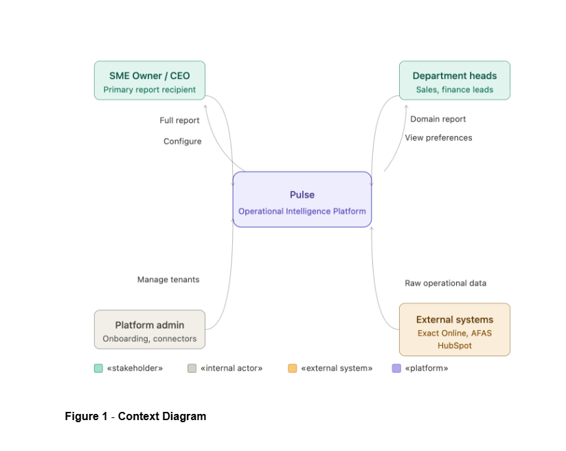
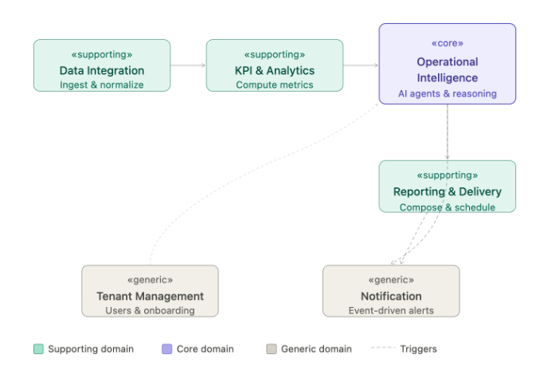
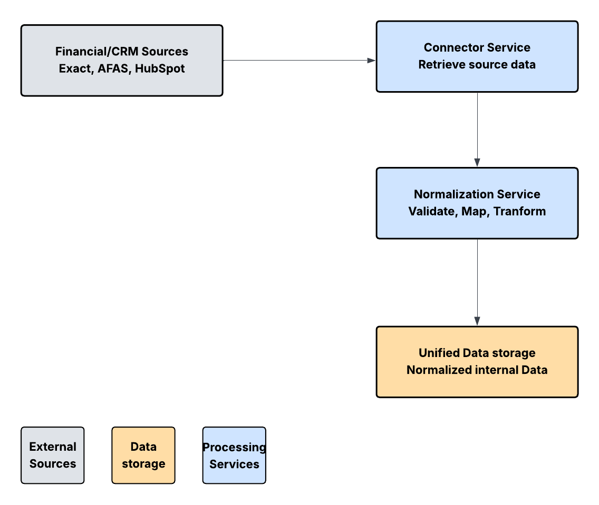

\newpage

# Section 1: Case Study

## **Business Scenario: "Pulse: Operational Intelligence Platform for SMEs"**

Small and medium-sized enterprises (SMEs) rarely have access to dedicated operational leadership. Business owners are left making critical decisions based on intuition rather than data, not because the data does not exist, but because synthesizing signals across financial systems, CRM platforms, and sales pipelines is too time-consuming to do consistently. The result is that operational problems (rising churn, deteriorating cash flow, stalling pipelines) are identified too late and acted on too slowly.

Pulse is an AI-powered Operational Intelligence Platform designed to fill this gap. Acting as a virtual Chief Operating Officer for SMEs, Pulse continuously ingests data from a company's core operational systems, computes key business metrics, detects anomalies and cross-functional patterns, and automatically generates narrative intelligence reports. Rather than functioning as a static dashboard, Pulse delivers actionable intelligence: it tells the SME owner not just what the numbers say, but what they mean and what to do about it.

The platform connects to two primary data source categories. The first is financial and accounting data, sourced from systems such as Exact Online and AFAS, covering revenue, expenses, cash flow, and outstanding invoices. The second is CRM and sales data, sourced from platforms such as HubSpot, covering pipeline value, conversion rates, churn, and new deals. Once ingested, data is normalized into a unified internal format, passed through a KPI calculation layer, and consumed by an AI agent layer that reasons across signals to produce structured, narrative intelligence reports. These reports are automatically delivered to the SME owner and relevant department heads on a scheduled cadence.

## **Stakeholders and Context Diagram**

Pulse serves four categories of external actors:

The **SME Owner / CEO** is the primary recipient of Pulse's intelligence. They receive full operational reports, act on recommendations, and represent the core user the platform is designed for.

**Department Heads** such as the head of sales or head of finance receive domain-specific report sections relevant to their area of responsibility. They interact with the platform as consumers of targeted intelligence rather than the full operational picture.

The **Pulse Platform Administrator** is an internal actor responsible for onboarding new SME clients, managing data source connectors, and maintaining platform health. This role justifies the Tenant Management domain.

**External Systems** such as Exact Online, AFAS, and HubSpot are the data providers. They do not interact with Pulse directly as users but represent the system boundary through which operational data enters the platform. We refer to @fig-context-diagram

## **High-Level Functional Requirements**

The platform must support the following high-level capabilities:

**Data ingestion and normalization.** Pulse must connect to external financial and CRM systems, retrieve operational data on a scheduled basis, and normalize it into a unified internal format for downstream processing.

**KPI computation.** The platform must compute a defined set of business metrics, including revenue growth, burn rate, cash flow position, pipeline conversion rate, and churn rate, from the normalized data and maintain a historical record of these metrics over time.

**Operational intelligence generation.** An AI agent layer must analyze computed KPIs, detect anomalies and trends, reason across signals from different operational domains, and generate natural language insights with actionable recommendations.

**Report composition and delivery.** Insights must be composed into structured, readable reports and automatically delivered to the SME owner and relevant department heads according to a configured schedule.

**Tenant and user management.** The platform must support onboarding of SME clients, management of user accounts and roles, and configuration of data source connections per tenant.

**Event-driven notifications.** The platform must send lightweight alerts for operationally significant events, such as critical anomaly detection, report delivery confirmation, or data connector failures.

## **Domain Overview**

Applying Domain-Driven Design to the functional requirements above, six domains are identified. These are explored in detail in Section 2.

Data Integration, KPI & Analytics, and Reporting & Delivery could all exist in any BI tool. What makes Pulse unique and differentiated is the reasoning layer that connects signals, understands context, and tells you what to do. We refer to @fig-domain-diagram

-   **Operational Intelligence** (core): the AI agent reasoning layer

-   **Data Integration** (supporting): external data ingestion and normalization

-   **KPI & Analytics** (core / supporting): metric computation and historical storage

-   **Reporting & Delivery** (core / supporting): report composition and scheduled delivery

-   **Tenant Management** (generic): SME onboarding, user accounts, configuration

-   **Notification** (generic): event-driven alerting

# Identification of Business/Data Domains and Services/Agents/Data Products

## **Operational Intelligence**

## **Data Integration**

**Bounded context description**: The data integration domain is responsible for ingesting, standardizing, and storing operational data from external systems such as financial platforms and CRM tools. It owns the full data ingestion pipeline, including API connectivity, data retrieval, validation, transformation into a unified schema, and persistence of both raw and normalized datasets. The domain ensures that heterogeneous data from multiple sources is made consistent and usable for downstream domains. 

The data integration domain does not compute business metrics, detect patterns, anomalies or generate insights. It also does not perform domain-level business logic or analytical reasoning. Its responsibility is limited to syntactic transformation and reliable data provisioning, acting as a data plumber layer between external systems and internal analytic components. 

**Features:**

-   Fetch financial transaction data from external financial systems APIs (e.g., Exact Online, AFAS)

-   Retrieve CRM data such as deals, pipeline status, and customer information from CRM platforms (e.g., HubSpot)

-   Validate incoming data against predefined schema constraints and data quality rules

-   Map source-specific data fields to a unified internal schema

-   Transform heterogeneous data into a standardized and consistent format

-   Persist both raw ingested data and normalized datasets for downstream consumption

-   Execute scheduled batch ingestion and transformation pipelines (e.g., weekly updates)

**Services / Agents / Data Products**

-   **Connector Service:** Handles connectivity with external systems and retrieves data via APIs on a scheduled or triggered basis.

    -   Design principles: Loose coupling and reusability, as connectors are isolated per source system and can be extended independently.

-   **Schema Mapping Service:** Maps source-specific data structures (e.g., financial records, CRM fields) into a unified internal schema.

    -   Design principles: High cohesion and abstraction, as it encapsulates all schema transformation logic in one place.

-   **Data Validation Service:** Validates incoming data against schema definitions and quality constraints before further processing.

    -   Design principles: Autonomy and reliability, ensuring data correctness without relying on downstream domains.

-   **Normalization Service:** Transforms validated data into a standardized format, resolving inconsistencies in structure, naming, and representation.

    -   Design principles: High cohesion and consistency, as all transformation logic is centralized and deterministic.

-   **Data Storage Service:** Persists both raw and normalized datasets in appropriate storage systems for traceability and downstream access.

    -   Design principles: Separation of concerns and scalability, allowing storage mechanisms to evolve independently.

**Design principles summary:\
**The Data Integration domain is designed around strong separation of concerns and high cohesion, where each service performs a clearly defined step in the ingestion pipeline. Loose coupling between services enables independent evolution of connectors, transformation logic, and storage mechanisms, which is essential when integrating multiple heterogeneous external systems. The domain is intentionally stateless in its processing steps, allowing scalable and repeatable batch execution. By strictly avoiding business logic and analytical reasoning, the domain maintains a clear boundary with downstream domains such as KPI & Analytics and Operational Intelligence, ensuring a modular and maintainable architecture.The Data Integration flow is intentionally shown at an abstract level. The normalization stage includes internal validation, schema mapping, and transformation steps before the resulting data is persisted in the unified data store. See @fig-data-integration

## **KPI & Analytics**

## **Reporting & Delivery**

## **Tenant Management**

## **Notification**

# Architectural Design

# Member Contribution and Reflection

## Member Contribution

## Reflection

# Technology Statement

Use the required template exactly as provided in the assignment brief .

Example format:

During the preparation of this work, we used \[NAME TOOL / SERVICE / VERSION\] in order to \[REASON\]. The following parts of the assignment were affected/generated by AI tool usage: \[SECTIONS\]. After using this tool/service, \[NAME STUDENT(S)\] evaluated the validity of the tool’s outputs and edited the content as needed. As a consequence, \[NAME STUDENT(S)\] take full responsibility for the content of this work.

# 6. References

# Appendix

{#fig-context-diagram}

{#fig-domain-diagram}

{#fig-data-integration}
